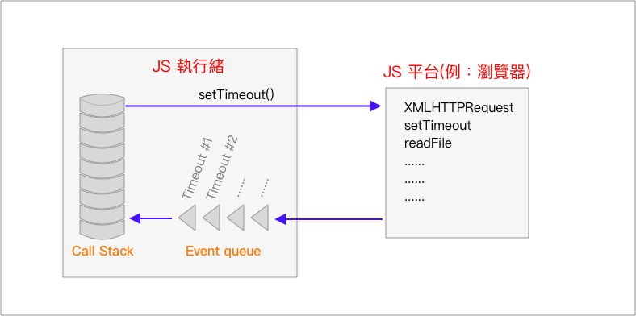

# 非同步、共時與平行處理

## JavaScript 的事件迴圈

概念圖如下：

<figure><figcaption></figcaption></figure>

JavaScript VM 模擬共時性的方式像這樣(如上圖)：

* JavaScript 的主執行緒(main thread)呼叫原生的非同步 API，像是 XMLHTTPRequest、setTimeout、readFile 等。
* 一旦呼叫原生的非同步 API，平台就會在它的 **事件佇列(event queue)** 中 入一個 **任務(task)**。每個執行緒都有它自己的佇列，作為中繼站將非同步運算的結果轉送回主執行緒。一個任務含有關於該次呼叫的一些詮釋資訊，以及一個參考指向來自主執行緒的某個 callbacks 回呼函式。
* 每當主執行緒的 **呼叫堆疊(call stack)** 空了，平台會檢查它的事件佇列，看有沒有待處理的任務。若有在等候的任務，平台就會執行它，那會觸發一個函式呼叫，而控制權會回到那個主執行緒函式。當源自那個函式呼叫的呼叫堆疊再次空了，平台會再次檢查事件佇列，尋找準備好執行的任務。這個迴圈會不斷重複，直到**呼叫堆疊**以及**事件佇列**都空了，而且所有非同步的 原生 API 呼叫 都已完成為止。

