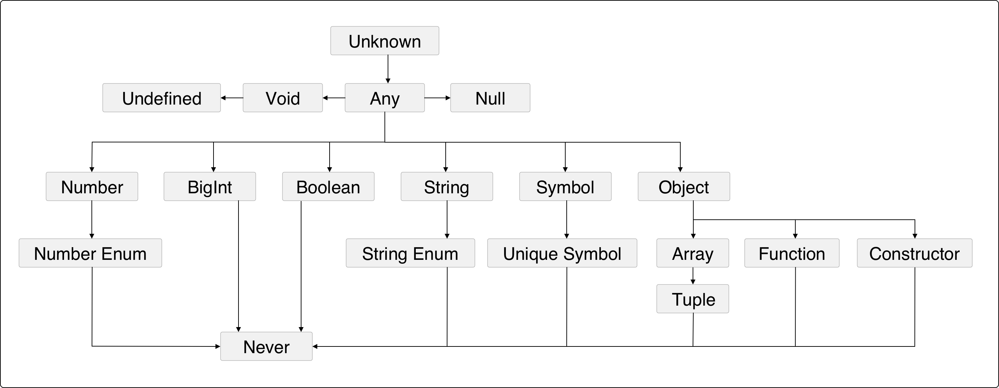

# 型別

## TypeScript 的型別階層架構

<figure><figcaption></figcaption></figure>


## 型別基礎 - Part1

### any

any 這個型別就是當你(開發者)和 TypeScript(型別檢查器) 都無法確定某個東西的型別是什麼時，所使用的預設型別。應該盡可能避免使用它。

為什麼應盡量避免呢？因為型別是一組值及你可以用它們來做的事。any 是所有的值所成的集合，而你可以用 any 來做任何事。那意味著，如果你有型別為 any 的一個值，你可以加東西到它身上、乘以它、在其中呼叫 .pizza()，任何事情都可以。

any 會讓你的值的行為就像在一般 JavaScript 中那樣，並使得型別檢查器完全無法施展它的魔法。


### unknown

對於有個值的型別你真的無法事先知道的這種少數情況，不要使用 any，而是找 unknown 幫忙。跟 any 一樣，它代表任何值，但在你對它進行檢查，確認它是什麼，藉此細分它之前，TypeScript 都不會讓你使用 unknown 型別。

例：


```typescript
let a: unknown = 30  // 自己指定 a 的型別為 unknown
let b = a === 123    // 可以比較
let c = a + 10       // Error TS2571：物件的型別為 unknown
if (typeof a === "number") {
  let d = a + 10
}
```


1、TypeScript 永遠都不會把某個東西推論為 uknown，必須是你明確的指定它為 unknown。

2、可以比較型別是 unknown 的值。

3、但是，不能假設 unknown 值是某個特定型別(所以上述的變數 c 會報錯)，必須先向 TypeScript 證明該值真的是某個型別才行。


### boolean

boolean 型別有兩個值：true 和 false。

例：


```typescript
let a = true          // boolean
var b = false         // boolean
const c = true        // true
let d: boolean = true // boolean
let e: true = true    // true
let f: true = false   // Error TS2322：型別 false 不可指定給型別 true
```


1、可讓 TypeScript 推論出值是 boolean。(變數 a、b)

2、可讓 TypeScript 推論出值是一個特定的 boolean。(常數 c)

3、明確告知 TypeScript 的值是一個 boolean。(變數 d)

4、明確告知 TypeScript 的值是一個特定的 bool。(變數 e、f)

5、**以 e 為例，它並不只是即有的任何 boolean，它是特定的 boolean 值 true。藉由使用一個值作為型別，基本上是限制了 e 可能的值，範圍從所有可能的 boolean 值縮小為特定的 boolean，這種功能叫做型別字面值**(**type literal**)。 **型別字面值：僅代表單一個值的型別**。

6、常數 c，因為值不能改變，所以推論出其型別為 true。


### number

number 是所有數字的集合：整數、浮點數、正數、負數、Infinity、NaN 等。例：


```typescript
let a = 1234            // number
var b = Infinity * 0.10 // number
const c = 5678          // 5678
let d = a < b           // boolean
let e: number = 100     // number
let f: 26.218 = 26.218  // 26.218
let g: 26.218 = 10      // 會報錯
```


1、可讓 TypeScript 推論出你的值是一個 number。(變數 a 和 b)

2、可用 const 促使 TypeScript 推論出你的值是一個特定的 number。(常數 c)

3、可明確告知 TypeScript 你的值是一個 number。(變數 e)

4、可明確告知 TypeScript 你的值是一個特定的 number。(變數 f 和 g)


**數值分隔符號(使用 `_` 底線)**

處理很大的數字時，善用數值分隔符號，易於閱讀：


```typescript
let oneMillion = 1_000_000            // 等同於 1000000
let twoMillion: 2_000_000 = 2_000_000 // 等同於 2000000
```



### bigint

**bigint** 是新引進的，能處理大型整數，而不會碰上捨入的錯誤(rounding error)。

number 型別只能表示最大為 2 的 53 次方的整數，而 biging 則可以表示比那還大的整數。

例：


```typescript
let a = 1234n        // bigint
const b = 5678n      // 5678n
var c = a + b        // bigint
let d = a < 1235     // boolean
let e = 88.5n        // 會報錯
let f: bigint = 100n // biging
let g: 100n = 100n   // 100n
let h: bigint = 100  // 會報錯
```


注意事項：

1、在 tsconfig.json 檔中的 target，至少要 es2020 才有支援。

2、小心檢查目標平台是否有支援 bigint。故還不建議使用 bigint。


### string

**string** 是所有字串的集合，例：


```typescript
let a = "hello"         // string
var b = "billy"         // string
const c = "!"           // !
let d = a + " " + b + c // string
let e: string = "zoom"  // string
let f: "john" = "john"  // john
let g: "john" = "zoe" // 會報錯
```



### symbol

**symbol(符號)** 是 ES2015 才引進的，實務上並不常用。例：


```typescript
let a = Symbol("a")         // symbol
let b: symbol = Symbol("b") // symbol
var c = a === b             // boolean
let d = a + "x"             // 會報錯，The '+' operator cannot be applied to type 'symbol'.
```


**`Symbol("a")`** 在 JavaScript 中的運作方式是創建一個具有給定名稱的新 symbol，這個 symbol 是唯一的，而且不會等於(以 `==` 或 `===` 進行比較時)任何其他的 symbol(即時以完全相同的名稱建立第二個 symbol 也一樣)。

symbol(符號) 會被推論為**`型別 symbol`**，但也能明確定型為 **`unique symbol`**，例：


```typescript
const e = Symbol("e")                // symbol
const f: unique symbol = Symbol("f") // symbol
let g: unique symbol = Symbol("f")   // 會報錯，因為 unique symbol，所以必需要用 const 宣告才行
let h = e === e                      // boolean
let i = e === f                      // error TS2367: This comparison appears to be unintentional because the types 'typeof e' and 'typeof f' have no overlap.
```


把 **unique symbol** 想成是其他的字面值型別，像是 1、true、 或 "literal"。它們是創造出一個型別來表示 symbol 中一個特殊住民的方式。


### 物件

TypeScript 的物件(object) 型別規範物件的型狀(shape)。值得注意的是，它們無法分辨簡單物件(用 **`{}`** 做的那種)和較為複雜的物件(用 **new** 創建的那種)之間的差異。這是刻意設計的：JavaScript 一般都是**結構定型(structurally typed)**，所以 TypeScript 會偏好那種風格的程式設計，而非**名義定型(nominally typed)**風格。

**結構定型(structurally typed)**：一種程式設計風格，其中你只在意一個物件是否具有特定特性，而非它的名稱為何(名義定型)。在某些語言中，也稱作 duck typing(鴨子定型)。

在 TypeScript 中，要使用型別來描述**物件**，有幾個方法可用。第一個是宣告一個值為 object：


```typescript
let a: object = {
  b: "x"
}
```


然而，若存取 **`a.b`** 是會報錯的，因為**「Property 'b' does not exist on type 'object'.」**。

為什麼會這樣？實際上，**object** 比 **any** 還要狹隘一些，但差不了多少。對於它所描述的值，object 不會告訴你太多資訊，只有**「該值是一個 JavaScript 物件(以及它不是 null)」**而已。


我們可以省去明確的注釋(annotation)，讓 TypeScript 做它的事情：


```typescript
let a = {
  b: "x"
}

let b = {
  c: {
    d: "f"
  }
}
```


這樣就正常了，這是定型一個物件的第二種方式：**物件字面值語法(object literal syntax)**。

可以讓 TypeScript 為你推論出物件的型狀，或在大括號 **`{}`** 內明確描述之：


```typescript
let a: {b: number} = {
  b: 12
}
```



**物件字面值語法(object literal syntax)**表達的是：「此處的這個東西有這種形狀」。那個東西可以是一個物件字面值，也可以是一個類別：


```typescript
let c: {
  firstName: string,
  lastName: string
} = {
  firstName: "john",
  lastName: "barrowman"
}

class Person {
  // public 是 this.firstName = firstName 的簡寫
  constructor(public firstName: string, public lastName: string){

  }
}

c = new Person("matt", "smith")
```


編譯完的結果：


```javascript
"use strict";
let c = {
  firstName: "john"
  lastName: "barrowman"
};
class Person {
  constructor(firstName, lastName) {
    this.firstName = firstName;
    this.lastName = lastName;
  }
}
c = new Person("matt", "smith");
```


`{firstName: string, lastName: string}` 描述一個物件的形狀(shape)，而那個物件字面值及上個範例的類別實體(class instance)都滿足該種形狀，所以 TypeScript 允許我們指定一個 Person 給 c。


另外來探討新增額外屬性的部份，例：


```typescript
let a: {b: number}

a = {} // 會報錯：Property 'b' is missing in type '{}' but required in type '{ b: number; }'.

// 以下也會報錯：
// Type '{ b: number; c: number; }' is not assignable to type '{ b: number; }'.
//  Object literal may only specify known properties, and 'c' does not exist in type '{ b: number; }'.
a = {
  b: 1,
  c: 2
}
```


TypeScript 對物件的屬性是嚴格的，以上例來說，如果指出物件應該有一個叫做 b 的特性，而且它是個 number，TypeScript 會預期要有 b 而且只能有 b。如果少了 b，或有其它額外的屬性，TypeScript 都會報錯。


有辦法告訴 TypeScript 某個東西是選擇性的嗎？可以的：


```typescript
let a: {
  b: number
  c?: string             // c 是選擇性的
  [key: number]: boolean // 此語法是索引特徵式(index signature)
}

a = {b: 1}
a = {b: 1, c: undefined}
a = {b: 1, c: "d"}
a = {b: 1, 10: true}
a = {b: 1, 10: true, 20: false}

a = {10: true}                  // 會報錯：屬性 b 在型別 {10: true} 中不存在
a = {b: 1, 33: "red"}           // 會報錯：型別 string 不可指定給型別 boolean
```



**索引特徵式(index signature)**：

**`[key: T]: U`** 這種語法被稱為索引特徵式(index signature)，告知 TypeScript 給定的物件可能含有更多的鍵值。可這樣讀它：**「對於此物件，型別為 T 的所有鍵值都必須有型別為 U 的值」**。索引特徵式讓你在明確宣告的鍵值之外，還能安全地新增更多鍵值到一個物件。

另有兩個注意事項：

* 索引特徵式的鍵值之型別(T)必須可被指定給 number 或 string。
* 可使用任何字詞作為索引特徵式的鍵值名稱，不必一定是 key。

例：


```typescript
let myData : {
  [seatNumber: string]: string
} = {
  "1A": "xxx",
  "2B": "yyy"
}
```



上例的「**選擇性(?)**」 是一個修飾詞，還有其它的修飾詞可使用，例如**唯讀(readonly)**：


```typescript
let user: {
  readonly firstName: string // firstName 是唯讀的
} = {
  firstName: "abby"
}

user.firstName = "ttt" // 會報錯：Cannot assign to 'firstName' because it is a read-only property.
```



物件字面值語法有一個特殊狀況：空的物件型別( **`{}`** )。除了 **`null`** 跟 **`undefined`** 之外，其它型別都能指定給一個空的物件型別。所以應儘量避免空的物件型別：


```typescript
let danger: {}

danger = {}
danger = {x: 1}
danger = []
danger = 2
```



有關物件的最後一個注意事項：將某個東西定型為**物件**的最後一種方式：**Object**。這幾乎與使用 **`{}`** 完全相同，並且最好也避開它。


## 認識型別別名、聯集與交集


### 型別別名

能宣告一個指向一個型別的**型別別名(type alias)**。例：


```typescript
type Age = number
type Person = {
  name: string
  age: Age
}
```


Age 只是一個 number，它能夠幫助 Person 的定義更容易理解。TypeScript 永遠都不會為別名進行推論，所以得明確為它們定型：


```typescript
let age: Age = 55

let driver: Person = {
  name: "James May",
  age: age
}
```



另外**型別別名**是以區塊為範疇(block-scoped)的，跟 let 和 const 一樣。例：


```typescript
type Color = "red"

let x = Math.random() < .5
if (x) {
  type Color = "blue"   // 這會遮蔽上面所宣告的 Color
  let b: Color = "blue"
} else {
  let c: Color = "red"
}
```



### 聯集與交集型別

TypeScript 提供特殊的**型別運算子(type operator)**來描述型別的聯集與交集：**`|`** 用來表示聯集，而 **`&`** 用來表示交集。例：


```typescript
type Cat = {name: string, purrs: boolean}
type Dog = {name: string, barks: boolean, wags: boolean}

type CatOrDogOrBoth = Cat | Dog
type CatAndDog = Cat & Dog
```


接續上面的程式，加上以下的程式，例：


```typescript
// Cat
let a: CatOrDogOrBoth = {
  name: "Bonkers",
  purrs: true
}

// Dog
a = {
  name: "Domino",
  barks: true,
  wags: true
}

// 兩者兼具
a = {
  name: "Donkers",
  barks: true,
  purrs: true,
  wags: true
}


let b: CatAndDog = {
  name: "Domino",
  barks: true,
  purrs: true,
  wags: true
}
```



聯集一般會比交集更常出現，以這個函式為例：


```typescript
function trueOrNull(isTrue: boolean) {
  if (isTrue) {
    return "true"
  }
  return null
}
```


以上這個函式會回傳什麼型別呢？可能是 string，也可能是 null。我們可以將其回傳型別表示為：


```typescript
type Returns = string | null
```



## 型別基礎 - Part2


### 陣列

就跟在 JavaScript 中一樣，TypeScript 的陣列是一種特殊的物件。例：


```typescript
let a = [1, 2, 3]       // number[]
var b = ["a", "b"]      // string[]
let c: string[] = ["a"] // string[]
let d = [1, "a"]        // (string | number)[]
const e = [2, "b"]      // (string | number)[]

let f = ["red"]
f.push("blue")
f.push(true)  // 會報錯

let g = []    // any[]
g.push(1)     // number[]
g.push("red") // (string | number)[]

let h: number[] = [] // number[]
h.push(1)            // number
h.push("red")        // 會報錯

// 對 d 陣列進行映射(map)運算，將每個字母轉為大寫，如果是數值，就乘以3倍：
d.map(_ => {
  if(typeof _ === "number"){
    return _ * 3
  }
  return _.toUpperCase()
})
```


TypeScript 支援陣列的兩種語法：**`T[]`** 與 **`Array<T>`**。這兩者在意義及效能上都完全相同。


上述的例子，變數 **`g`** 是一個特例：初始化一個空陣列的時候，TypeScript 並不知道陣列的元素應該是什麼型別，所以它保留了不確定的空間，讓它們成為 any。但加入元素進去之後，TypeScript 就據此拼湊出你陣列的型別。然而，一旦該陣列離開它定義處的範疇(例如在函式中宣告它，然後回傳)，TypeScript 會指定一個無法再擴充的最終型別：


```typescript
function buildArray() {
  let a = []  // any[]
  a.push(1)   // number[]
  a.push("x") // (string | number)[]
  return a
}
let myArray = buildArray() // (string | number)[]
myArray.push(true) // 會報錯：Argument of type 'boolean' is not assignable to parameter of type 'string | number'.
```



### 元組(tuple)

**`元組(tuple)`** 是 array 的子型別(subtype)。它們是為具有**固定長度的陣列**定型的一種特殊方式，其中每個索引上的值都有已知的特定型別。元組宣告時，必須明確地定型(explicitly typed)。例：


```typescript
let a: [number] = [1]

let b: [string, string, number] = ["a", "b", 1963]
b = ["a", "b", "c", 1926] // 會報錯：Type 'string' is not assignable to type 'number'.
```



**`元組(tuple)`**也支援**選擇性的元素**，就像在物件型別中那樣，**`?`** 代表「選擇性(optional)」：


```typescript
// 火車票價所構成的一個陣列，它們有時會隨著方向不同而變
let trainFares: [number, number?][] = [[3.75], [8.25, 7.70], [10.50]]
// 等同於
let moreTrainFares: ([number] | [number, number])[] = [[3.75], [8.25, 7.70], [10.50]]
```



**`元組(tuple)`** 也支援**其餘元素(rest elements)**，可用來定型具有最小長度的元組：


```typescript
// 由字串組成的一個陣列，至少要有一個元素
let friends: [string, ...string[]] = ["a", "b", "c", "d"]

// 一個異質陣列
let list: [number, boolean, ...string[]] = [1, false, "a", "b", "c"]
```



#### 唯讀陣列與元組(tuple)

TypeScript 內建有一種 **readonly** 的陣列型別，你可用它來創建不可變的陣列。**唯讀陣列(read-only arrays)** 就像一般的陣列，但你無法在原地更新它們。要建立一個唯讀陣列的話，需使用明確的型別注釋。例：


```typescript
let as: readonly number[] = [1, 2, 3]    // readonly number[]
let bs: readonly number[] = as.concat(4) // readonly number[]
let three = bs[2]                        // number

as[4] = 5  // 會報錯：Index signature in type 'readonly number[]' only permits reading.

as.push(6) // 會報錯：Property 'push' does not exist on type 'readonly number[]'.
```



TypeScript 也附有幾種形式較長的語法用以宣告唯讀陣列和元組，要用哪種寫法都可：


```typescript
type A = readonly string[]     // readonly string[]
type B = ReadonlyArray<string> // readonly string[]
type C = Readonly<string[]>    // readonly string[]

type D = readonly [number, string]  // readonly [number, string]
type E = Readonly<[number, string]> // readonly [number, string]
```



### null、undefined、void 與 never

JavaScript 有兩個值用來表示東西的缺乏(absence of something)：**`null`** 和 **`undefined`**。TypeScript 也為它們準備型別，名稱一樣，也叫做 **`null`** 和 **`undefined`**。

* null 型別：唯一的值就是 null。表示一個值的缺乏。
* undefined 型別：唯一的值就是 undefined。尚未被指定一個值的變數。
* void 型別：是沒有明確回傳任何東西的函式( 例：console.log )之回傳型別。沒有 return 述句的函式。
* never 型別：是永遠都不會回傳的函式( 例如擲出例外的函式，或是會不停執行的函式 )之型別。永不回傳的函式。

例：


```typescript
// 一個會回傳數字或 null 的函式
function a(x: number) {
  if(x < 10){
    return x
  }
  return null
}

// 回傳 undefined 的一個函式
function b(){
  return undefined
}

// 回傳 void 的一個函式
function c(){
  let a = 2 + 2
  let b = a * a
}

// never: 永不回傳的一個函式
function d() {
  throw TypeError("I always error")
}

// never: 這是另一個永不回傳的一個函式
function e(){
  while(true){
    console.log("tt");
  }
}
```



註：如果 unknown 是其他所有型別的超型別(supertype)，那麼 never 就是其他所有型別的子型別(subtype)。我們稱之為一個底限型別(bottom type)。


### Enums

**Enums** 是為一個型別 **`列舉(enumerate)`** 出可能的值的一種方式。它們是將鍵值(key)映射至值(value)的**無序(unordered)資料結構**。

按照習慣，enum 的名稱會是**大寫而且單數**，它們的鍵值也都是大寫。

Enums 有兩種，從字串映射(map)至**字串**的 enums；以及從字串映射(map)至**數字**的 enums。例：


```typescript
enum Language {
  English,
  Spanish,
  Russian
}
```


上述程式碼，編譯後，會變成是：


```javascript
"use strict";
var Language;
(function (Language) {
    Language[Language["English"] = 0] = "English";
    Language[Language["Spanish"] = 1] = "Spanish";
    Language[Language["Russian"] = 2] = "Russian";
})(Language || (Language = {}));
```


然後若將變數 Language 印出來看的話，得到：


```json
{
  '0': 'English',
  '1': 'Spanish',
  '2': 'Russian',
  English: 0,
  Spanish: 1,
  Russian: 2
}
```



TypeScript 會自動推論出一個數字作為你的 enum 每個成員的值，但你也可以明確設定那些值，例：


```typescript
enum Language {
  English = 0,
  Spanish = 1,
  Russian = 2
}
```



要從一個 enum 取得一個值，可以用點號(dot) 或 中括號(bracket) 記法，就像從一般的物件取值那樣：


```typescript
let a = Language.Russian
let b = Language["English"]
```



也可以將 enum 分散為數個宣告，而 TypeScript 會自動合併。要留意的是，分割你的 enum 時，TypeScript 只能為那些宣告的其中一個推論出值，所以良好的做法是明確指定一個值給每個 enum 成員：


```typescript
enum Language {
  English = 0,
  Spanish = 1
}

enum Language {
  Russian = 2
}
```



也可以使用計算出來的值，而也不必全都定義(TypeScript 會盡力推論出缺少的部分)：


```typescript
enum Language {
  English = 100,
  Spanish = 200 + 300,
  Russian  // TypeScript 會推論這個出來的值為 501(500 後的下一個數字)
}
```


所以上述程式碼，編譯後的程式為：


```javascript
"use strict";
var Language;
(function (Language) {
    Language[Language["English"] = 100] = "English";
    Language[Language["Spanish"] = 500] = "Spanish";
    Language[Language["Russian"] = 501] = "Russian";
})(Language || (Language = {}));
```



也能為 enums 使用字串值，或甚至混合字串與數值：


```typescript
enum Color {
  Red = "#c10000",
  Blue = "#007ac1",
  Pink = 0xc10050,
  White = 255
}

let red = Color.Red
let pink = Color.Pink
```


編譯後的程式為：


```javascript
"use strict";
var Color;
(function (Color) {
    Color["Red"] = "#c10000";
    Color["Blue"] = "#007ac1";
    Color[Color["Pink"] = 12648528] = "Pink";
    Color[Color["White"] = 255] = "White";
})(Color || (Color = {}));
let red = Color.Red;
let pink = Color.Pink;
```


為了方便，藉由值或鍵值來存取 enums 皆可，TypeScript 都會允許，但這很快就會變得不安全，沿續上例的程式：


```typescript
let b = Color.Green // 這會報錯：Property 'Green' does not exist on type 'typeof Color'.
let c = Color[255]

let d = Color[6] // 這應該要報錯，但並沒有報錯
```


上述程式碼 **`Color[6]`** 應該要報錯，但卻沒有報錯。我們可以要求 TypeScript 避免這種不安全的存取，方法是改用 **`const enum`**，就會變成是只能用**`字串字面值`**來取得資料，讓我們改寫前面的 Language enum：


```typescript
const enum Language {
  English,
  Spanish,
  Russian
}

let a = Language.English

let b = Language.Tagalog // 會報錯：Property 'Tagalog' does not exist on type 'typeof Language'.
let c = Language[0]      // 會報錯：A const enum member can only be accessed using a string literal.
let d = Language[6]      // 會報錯：A const enum member can only be accessed using a string literal.
```


一個 **`const enum`** 並不允許你進行**反向查找(reverse lookup)**，它也不會產生任何 JavaScript 程式碼。TypeScript 會把 `Language.Spanish` 出現的每個地方取代為它的值，也就是 1。


